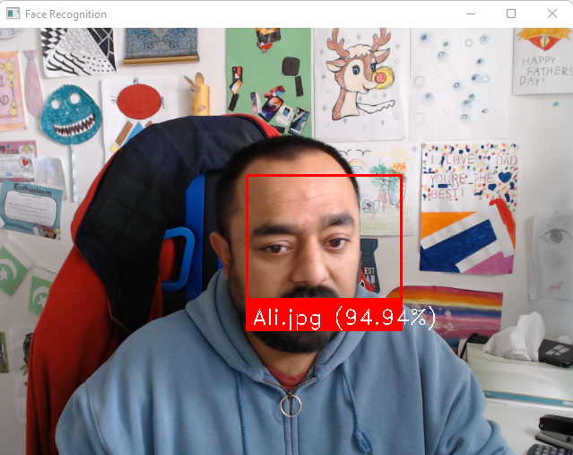

# Face Recognition System for Audit & Access Assurance
### Using Python, OpenCV, and Face Recognition

---

## 1. Problem Statement

Organisations rely on **physical and logical access controls** to ensure that only authorised individuals can:
- access sensitive facilities,
- use restricted systems,
- or perform critical operational tasks.

Traditional access assurance mechanisms include:
- ID badges,
- passwords,
- access logs,
- CCTV footage reviewed manually.

From an **audit perspective**, these approaches have limitations:
- identity verification may be manual or inconsistent,
- evidence is often retrospective and sample‑based,
- there is limited automation in validating *who actually accessed* a system or location.

Audit needs **objective, repeatable evidence** that access is:
- limited to authorised individuals,
- accurately logged,
- and monitored in near‑real time.

---

## 2. Audit Ask

> **Can facial recognition be used as a supplementary control to validate physical or system access and strengthen audit assurance over identity‑based access controls?**

---

## 3. Objective

The objectives of this solution are to:

- Implement real‑time face recognition using a camera feed.
- Compare detected faces against a known, authorised face repository.
- Display identity and confidence scores during recognition.
- Demonstrate how computer vision can support **access assurance and audit monitoring**.

---

## 4. Solution Overview

This project implements a **face recognition pipeline** using:
- `face_recognition` (face encoding & matching),
- `OpenCV` (video capture and visualisation),
- `NumPy` (distance calculations).

The solution consists of **three logical components**:

1. Face encoding of authorised users.
2. Real‑time recognition via webcam.
3. Visual feedback with identity & confidence score.

---

## 5. Code Structure

### 5.1 recognition.py

This file contains the **core face recognition logic**, including:
- face encoding,
- face matching,
- confidence calculation,
- real‑time video processing.

### 5.2 main.py

This file acts as the **execution entry point**, initialising the system and starting recognition.

### 5.3 Webcam Test Script

A simple OpenCV script is included to:
- validate camera access,
- test video feed functionality.

This script is provided **only for testing purposes** and is **not part of the business solution**.

---

## 6. Methodology

### Step 1 – Preparing Known Faces

Authorised individuals’ images are stored in a local folder (`faces/`).

Each image is:
- loaded,
- converted into a facial encoding,
- stored along with the filename as the identity label.

#### Why this matters (Audit Lens)
- Establishes the **authoritative population** of permitted users.
- Allows audit to verify that recognition is limited to approved identities.

---

### Step 2 – Face Encoding and Matching

The system:
- captures frames from a webcam,
- detects faces,
- encodes detected faces,
- compares them against known encodings.

The best match is identified using **minimum face distance**.

---

### Step 3 – Confidence Scoring

A custom `face_confidence()` function:
- transforms facial distance into a percentage confidence,
- helps differentiate:
  - strong matches,
  - weak matches,
  - unknown faces.

#### Audit relevance
- Enables **threshold‑based decisions**.
- Confidence scores can support evidentiary conclusions rather than binary matches.

---

### Step 4 – Real‑Time Recognition

During execution:
- every alternate frame is processed to improve performance,
- recognised faces are labelled with:
  - name,
  - confidence score,
- unknown faces are explicitly identified.

   
Figure 1: Face recognition output

---

### Step 5 – Visual Evidence Generation

Bounding boxes and labels are drawn on the video feed:
- red box around detected face,
- label containing identity and confidence.

This provides **visual, auditable evidence** of recognition decisions.

